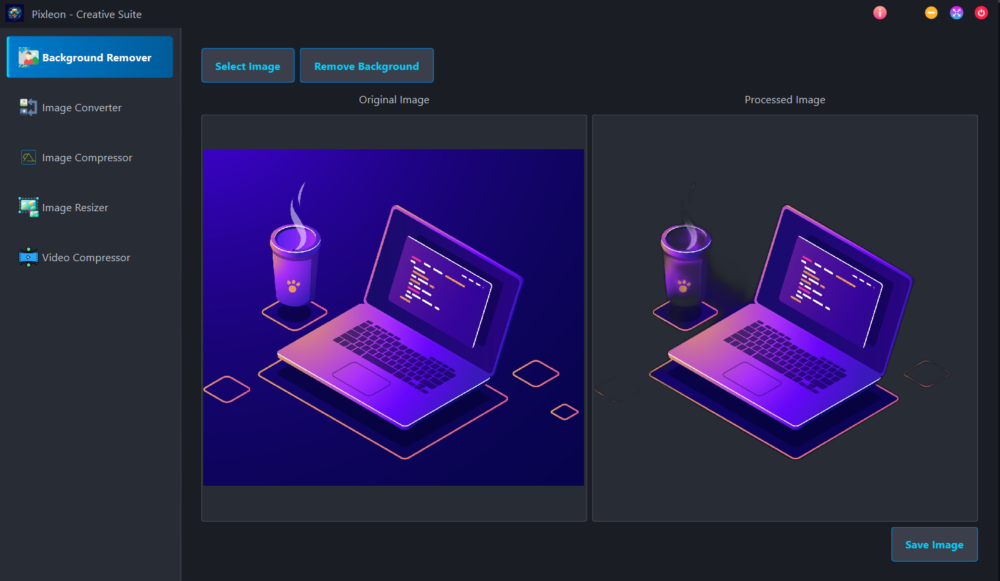

# Pixleon - Creative Suite

Welcome to Pixleon, your friendly neighborhood desktop app for quick and easy image and video tasks!

Think of it like a digital multi-tool for your media files, designed to be simple enough for anyone to use, even if you've never written a line of code.



## ✨ Features

Pixleon offers a suite of tools accessible from a clean sidebar:

*   **Background Remover:** Magically zap the background out of your images (powered by `rembg`).
*   **Image Converter:** Change image formats between common types like PNG, JPG, WEBP, GIF, BMP, and TIFF.
*   **Image Compressor:** Make image files smaller (especially JPEGs and WEBPs) to save space or speed up uploads.
*   **Image Resizer:** Easily change the dimensions (width and height) of your images, with an option to keep the original proportions.
*   **Video Compressor:** Shrink down video files using the power of FFmpeg. The app will try to use a bundled version of FFmpeg first (if included during build), otherwise it requires FFmpeg to be installed separately.
*   **Custom Look:** A sleek, custom user interface with a frameless window design.

## 🚀 Installation & Running

You have two main ways to use Pixleon: running it directly from the source code (good for developers or tinkering) or creating a standalone executable file.

### Method 1: Running from Source Code (More Technical)

This method requires you to have Python installed and be comfortable with the command line.

**Prerequisites:**

1.  **Python:** You'll need Python installed (version 3.7 or newer recommended). You can get it from [python.org](https://www.python.org/downloads/). Make sure to check the box that says "Add Python to PATH" during installation.
2.  **Git (Optional):** You only need Git if you want to clone the repository using the `git clone` command. You can download it from [git-scm.com](https://git-scm.com/downloads).
3.  **(Recommended) FFmpeg:** For the **Video Compressor** tool to work reliably, it's best to have FFmpeg installed *and* accessible in your system's PATH. The application *will* try to find it even if it's not in the PATH (if bundled), but having it in the PATH is a good fallback.
    *   **Windows:** Download from [FFmpeg official builds](https://www.gyan.dev/ffmpeg/builds/) (get the "full" build), unzip it, and add the `bin` folder inside to your system's PATH environment variable.
    *   **macOS:** Use Homebrew: `brew install ffmpeg`
    *   **Linux:** Use your package manager (e.g., `sudo apt update && sudo apt install ffmpeg` on Debian/Ubuntu, `sudo dnf install ffmpeg` on Fedora).

**Steps:**

1.  **Get the Source Code:**
    *   **Option A (Using Git):** Open your terminal or command prompt and run:
        ```bash
        git clone <repository_url> # Replace <repository_url> with the actual URL
        cd Pixleon # Or whatever the folder name is
        ```
    *   **Option B (Download ZIP):** Download the project as a ZIP file (usually via a "Code" button on the repository page) and unzip it somewhere on your computer. Open your terminal/command prompt and navigate into the unzipped folder using the `cd` command.

2.  **Create a Virtual Environment (Highly Recommended):** This keeps the project's dependencies separate from your system's Python.
    ```bash
    python -m venv venv
    ```
    Then activate it:
    *   Windows: `venv\Scripts\activate`
    *   macOS/Linux: `source venv/bin/activate`
    *(You should see `(venv)` at the beginning of your command prompt line.)*

3.  **Install Dependencies:** Install all the required Python libraries.
    ```bash
    pip install -r requirements.txt
    ```

4.  **Run the App:**
    ```bash
    python main.py
    ```

Pixleon should now launch!

### Method 2: Creating a Standalone Executable (Easier Distribution)

This method uses a tool called **PyInstaller** to bundle the Python code, libraries, and assets into a single executable file (or a folder containing an executable).

**Prerequisites:**

1.  Follow steps 1-3 from **Method 1** above (Get Source Code, Create/Activate Virtual Environment, Install Dependencies). You need the source code and libraries installed first to build the executable.
2.  **Install PyInstaller:** Make sure your virtual environment is activated (`(venv)` should be visible) and run:
    ```bash
    pip install pyinstaller
    ```
3.  **(Optional) Get FFmpeg Binary:** If you want to bundle FFmpeg *inside* your application (making it larger but potentially easier for end-users), download the correct FFmpeg executable (`ffmpeg.exe` / `ffmpeg` and ideally `ffprobe.exe` / `ffprobe`) for the operating system you are building *on*. Place these executables somewhere accessible (e.g., a `bin/` folder in your project).

**Building the Executable:**

PyInstaller needs to know about your main script (`main.py`) and any extra data files (`assets`, `ui/styles.qss`). If you choose to bundle FFmpeg, you'll add `--add-binary` flags.

1.  **Navigate to Project Directory:** Open your terminal or command prompt and make sure you are in the Pixleon project's root directory.

2.  **Run PyInstaller:** Choose one of the options below. Add the `--add-binary` lines only if you downloaded FFmpeg binaries and want to include them.

    *   **Option A: One-Folder Bundle (Recommended)**

        *(Run ONE of the following, adding `--add-binary` lines if bundling FFmpeg):*

        **Windows:**
        ```bash
        pyinstaller --name Pixleon --windowed --icon=assets/icon.ico ^
            --add-data "assets;assets" ^
            --add-data "ui/styles.qss;ui" ^
            REM --add-binary "path\to\your\ffmpeg.exe;." ^
            REM --add-binary "path\to\your\ffprobe.exe;." ^
            main.py
        ```
        *(Remove `REM` from `--add-binary` lines and adjust paths if bundling FFmpeg)*

        **macOS / Linux:**
        ```bash
        pyinstaller --name Pixleon --windowed --icon=assets/icon.png \
            --add-data "assets:assets" \
            --add-data "ui/styles.qss:ui" \
            # --add-binary "path/to/your/ffmpeg:." \
            # --add-binary "path/to/your/ffprobe:." \
            main.py
        ```
        *(Uncomment `--add-binary` lines and adjust paths if bundling FFmpeg)*

    *   **Option B: Single-File Executable**

        *(Run ONE of the following, adding `--add-binary` lines if bundling FFmpeg):*

        **Windows:**
        ```bash
        pyinstaller --name Pixleon --onefile --windowed --icon=assets/icon.ico ^
            --add-data "assets;assets" ^
            --add-data "ui/styles.qss;ui" ^
            REM --add-binary "path\to\your\ffmpeg.exe;." ^
            REM --add-binary "path\to\your\ffprobe.exe;." ^
            main.py
        ```
        *(Remove `REM` from `--add-binary` lines and adjust paths if bundling FFmpeg)*

        **macOS / Linux:**
        ```bash
        pyinstaller --name Pixleon --onefile --windowed --icon=assets/icon.png \
            --add-data "assets:assets" \
            --add-data "ui/styles.qss:ui" \
            # --add-binary "path/to/your/ffmpeg:." \
            # --add-binary "path/to/your/ffprobe:." \
            main.py
        ```
         *(Uncomment `--add-binary` lines and adjust paths if bundling FFmpeg)*

    **Command Notes:**
    *   `--add-binary "source;destination"` (or `:`) copies an executable/library. Using `.` as the destination places it in the bundle's root.
    *   See the previous `README.md` version or PyInstaller docs for a full breakdown of other flags.

3.  **Find Your Executable:** Look inside the `dist` folder for your `Pixleon` folder or single executable file.

4.  **Distribute:** Zip the `Pixleon` folder or share the executable.
    *   If you **bundled** FFmpeg, the video compressor *should* work out-of-the-box (but the app size is larger, and check FFmpeg license terms).
    *   If you **did not bundle** FFmpeg, users **must still install FFmpeg and have it in their PATH** for the video compressor to function.

## 🖱️ Usage

1.  **Launch:** Double-click the `Pixleon` executable (or run `python main.py`).
2.  **Navigate:** Use the sidebar buttons to switch tools.
3.  **Follow Instructions:** Each tool has its own controls. Check tooltips for hints.

## 🤝 Contributing

Feel free to contribute!

## 📄 License

I made this! So technically it's mine, you know? Feel free to poke around with the code, just promise not to make the exact same app (even though there are millions of similar apps & webapps). 😂🤣 